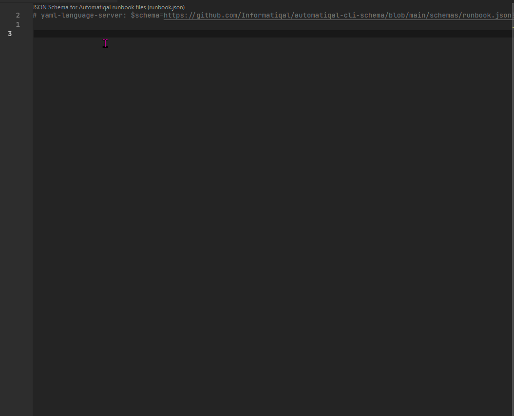

# Automatiqal CLI

[](https://ko-fi.com/T6T0148ZP)

> **Warning**
> UNDER DEVELOPMENT

`Automatiqal CLI` is a `NodeJS` wrapper around [Automatiqal](https://github.com/informatiqal/automatiqal) package that allows automating `Qlik Sense` administration/deployment tasks by describing them in `yaml`/`json` files.

As the name suggests `Automatiqal CLI` is a command line/terminal tool.

> **Note**
> At the moment only `Qlik Sense Enterprise on Windows` is supported! SaaS support is on the roadmap

## Installation

Install as global module:
`npm install -g automatiqal-cli`

## Usage

- All available commands can be displayed at any time by running `automatiqal` with the `--help` flag or running it without any flag:

  `$ automatiqal --help`
  `$ automatiqal`

  ```text
  --file       -f     Location of the file, containing the run book data
  --variables, -v     Location of the variable file (if needed)
  --json              Indicates that the run book file is in JSON format
  --output,    -o     Saves the result in the provided path
  --connect,   -c     Test the connectivity. No tasks are ran
  --sample,    -s     Generate sample run book and variables files in the current folder
  --help,      -h     Shows this message
  ```

- `--file` - pass the location of the `yaml` file
  `$ automatiqal --file path/to/deployment/file.yaml`

- `--variables` - pass the location of the variables file
  `$ automatiqal --file path/to/deployment/file.yaml --variables path/to/deployment/variables-file.yaml`

- `--json` - if the source file is in `json` format then `--json` flag should be added as an extra parameter
  `$ automatiqal --file path/to/deployment/file.json --json`

- `--output` - to save the result of the run book in a json file
  `$ automatiqal --file path/to/deployment/file.yaml --output path/to/result.json`

- `--sample` - generate sample `yaml` file in the current folder
  `$ automatiqal --sample`

## Runbook examples

Have a look at the [examples folder](https://github.com/Informatiqal/automatiqal-cli/tree/main/runbook-examples) for list of example `yaml` files (btw these runbooks are used to test `Automatiqal CLI` itself)

---

Example of importing an app and publishing it to a new stream:

```yaml
name: Sample run book
edition: windows
environment:
  host: ${host}
  port: 443
  proxy: jwt
  authentication:
    token: ${jwt_token}
tasks:
  - name: Import application
    description: Import brand new qvf
    operation: app.upload
    details:
      file: ${qvfLocation}
      name: Something New
  - name: Create stream
    operation: stream.create
    details:
      name: New Stream
  - name: Publish app
    operation: app.publish
    source: Import application
    details:
      stream: New Stream
      name: Something New (Published)
```

Creating new external task, trigger scheduling and tagging the task:

```yaml
name: External Task operations
edition: windows
environment:
  host: ${host}
  port: 4242
  authentication:
    cert: ${certificate}
    key: ${certificate_key}
    user_dir: ${user_dir}
    user_name: ${user_name}
tasks:
  - name: Create tags
    operation: tag.createMany
    details:
      names: ["Tag Value 1", "Tag Value 2"]
  - name: Create external task
    operation: externalTask.create
    details:
      name: New external task
      path: c:\ProgramFiles\Qlik\Sense\ServiceDispatcher\Node\node.exe
      parameters: d:\temp\index.js
  - name: Add trigger schema to task
    operation: externalTask.addTriggerSchema
    filter: name eq 'New external task'
    details:
      name: Simple daily trigger
      repeat: Daily
      repeatEvery: 1
      startDate: 2022-02-07T14:30:00.000
  - name: Add multiple trigger schema to task
    operation: externalTask.addTriggerMany
    filter: name eq 'New external task'
    details:
      - name: Weekly trigger
        repeat: Weekly
        startDate: 2022-02-07T12:30:00.000
        daysOfWeek:
          - Monday
          - Wednesday
          - Sunday
      - name: Monthly trigger
        repeat: Monthly
        enabled: false
        startDate: 2022-02-07T13:30:00.000
        daysOfMonth: [1, 5, 10]
  - name: Update external task
    operation: externalTask.update
    filter: name eq 'New external task'
    details:
      tags:
        - Tag Value 1
        - Tag Value 2
```

## Documentation

Have a look at `Automatiqal` package [wiki pages](https://github.com/Informatiqal/automatiqal/wiki) on how to structure the file and list of operations. More information will be added soon here as well

## Schema

Great little addition is the availability of [YAML schema](https://github.com/Informatiqal/automatiqal-cli-schema). The schema greatly helps when writing runbooks. Please refer to the schema's repo on how to use it (in `VSCode`)

> **Warning**
> The schema is also under development and some bugs/issues are possible/expected

## Limitations

- no way to test the runbook (aka `dry run`) [automatiqal #6](https://github.com/Informatiqal/automatiqal/issues/6)
- handling large files. In the current implementation all external files are read before the runbook is executed. This can be a problem when uploading large files [automatiqal #4](https://github.com/Informatiqal/automatiqal/issues/4)

## Demonstration

Short video how writing the runbook feels (with the json schema)


